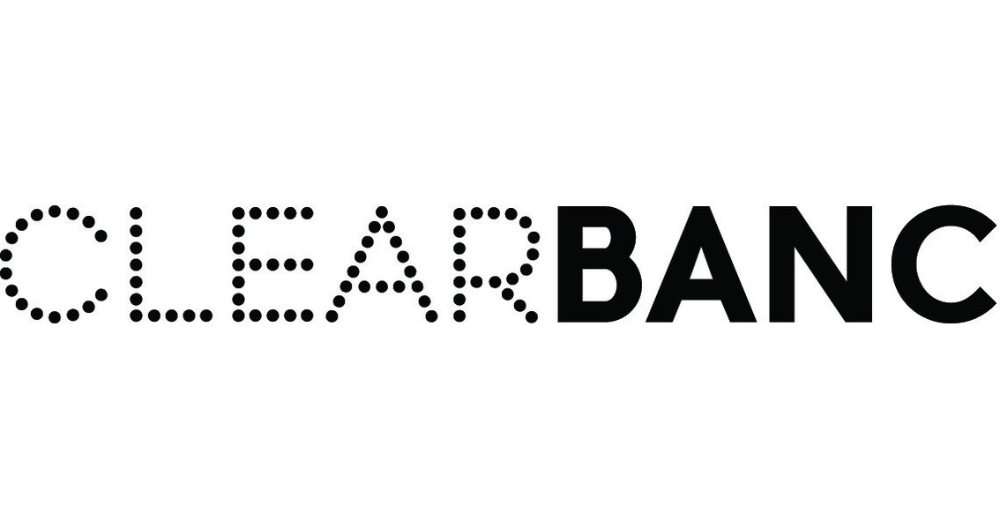
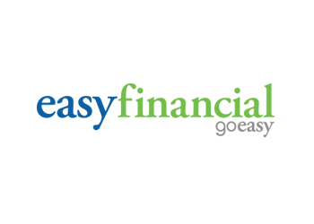
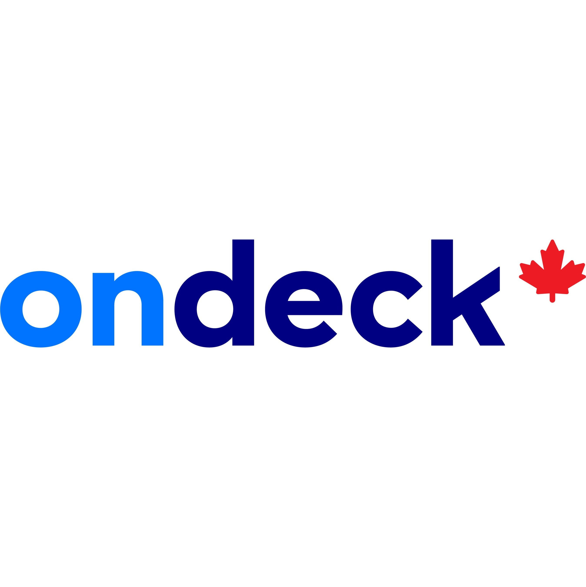
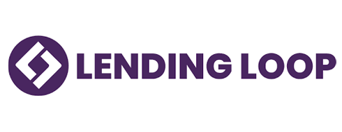
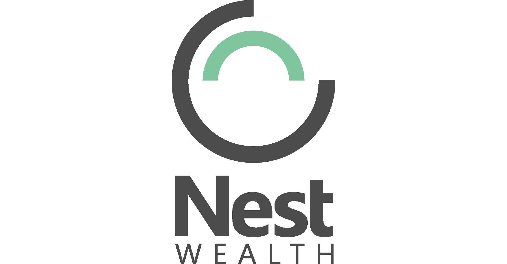
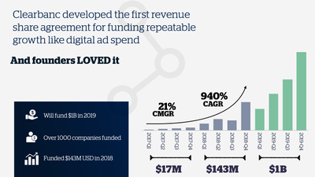

# Clearbanc Case Study

## Clearbanc Origin & Company Overview

 

Clearbanc is a modern non-dillutive capital as a service (CaaS) firm. The FinTech comapny was founded in 2015 and is headquartered in Toronto, Canada.

**President & Co-founder**: Michele Romanow (left) 
**CEO & Co-founder**: Andrew D’Souza (right)

Additional **key members** include; 
* VP of finance & co-founder: Ivan Gritsiniak
* VP of Business operations & co-founder: Charlie Feng
* VP of product & co-founder: Tanay Delima

### How did the idea for the company (or project) come about?

*“By founders for founders”* - both Romanow and D’Souza are considered serial entrepreneurs with admirable experience and success in the digital industry. Experiencing both sides of the entrepreneurial field, Clearbanc partners recognized a serious flaw in the current funding systems available to emerging businesses and startups. Founders are passionate about their ideas and should not have to offer a portion of their business to private equity investors to fulfill their business objectives. The market had a desperate need for a modern funding structure (que Clearbanc). Inspired by their own experiences, Clearbanc devised a solution; an equity-free investor model.

### How is the company funded? How much funding have they received?

Backed by outstanding reputation and experience, Clearbanc founders' alternative to the venture capitalist idea continues to attract growing attention from investors. The most recent equity report released in 2019 indicates Clearbanc has had two funding periods raising a total of $300 million CAD. From the public records Clearbanc provides, over 80 per cent ($250 million CAD) of acquired equity is provided by the company’s limited partners. The raised capital is allocated as a series three fund to assist Clearbanc’s ecommerce partners develop their business efforts successfully. The remaining portion of total funding Clearbanc received was at the end of 2018, allocating $50 million CAD as a series B funding source from high stake investors such as; Highland Capital, iNovia, and Emergence Capital.

## Business Activities

### What specific financial problem is the company or project trying to solve?

With successful experience launching and leading several businesses oriented on the digital economy, the co-founders of Clearbanc recognized a significant issue in the entrepreneurial funding system. Startups, emerging businesses, and early-stage companies require access to equity funding to pursue their entrepreneurial desires. However, many of these businesses stakeholders must sacrifice a portion of ownership to private equity firms or stake personal assets to receive the necessary funding required to achieve their dreams. Romanow, a digital entrepreneur launching five successful startup companies and D’Souza raising millions of dollars and advising several startups and investors recognized the demand amongst millennial entrepreneurs. Thus, came the innovation of a venture capital firm that is not your ordinary venture capitalist; Clearbanc. 

### Who is the company's intended customer?  Is there any information about the market size of this set of customers?

Clearbanc was founded on the vision of providing entrepreneurs in the sharing economy an alternative to the traditional funding and lending options available to the freelance sector. Clearbanc recognized the growth in the segment of freelancers delivering in-demand digital services. Throughout the upcoming decade, the market size is expected to double in North America. Clearbanc’s revenue model penetrates the freelance economy by supporting and providing financial services to direct-to-consumer e-commerce entrepreneurs. Direct-to-consumer retailers is a growing market segment with a growing demand in funding from angel investors, venture capitalists, and banks. However, many of these ecommerce entrepreneurs compromise their ownership significantly to acquire the capital funding required to build their online business and attract their consumer segment. Clearbanc co-founder Romanow mentions, many of these dtc freelancers do not recognize the potential worth their equity could gain throughout the next few years. If Clearbanc’s vision is successful, they will have a major supporting role in the freelance and sharing economy assisting entrepreneurs own a higher percentage of their business.

### What solution does this company offer that their competitors do not or cannot offer? (What is the unfair advantage they utilize?)

Freelancers are viewed as high risk investments in the traditional financial service industry, and often cannot receive the necessary capital without being subject to disproportionate fees and interest rates. Banking investors and private equity firms demand high stakes when investing in startup businesses to ensure their growth strategy and return on investment is maximized. However, with Clearbanc as the equity partner, digital entrepreneurs are not subject to the traditional “clunky” (as Romanow shares it) financing systems due to the fintech’s revenue share model.

Clearbanc offers its ecommerce partners what is known as a non-dilutive revenue share agreement. This means entrepreneurs do not have to jeopardize their personal assets and business stake to receive the equity they need. Not only does Clearbanc provide modern venture capital solutions, they provide their services through an accessible platform. Eliminating physical barriers and time constraints typically associated with attracting investors and closing the deal, Clearbanc introduced a unique tactic to determine credit underwriting decisions through the “20-minute term sheet.” Investment is based on two positive metrics; ad spending and unit economics of the startup, and a machine learning algorithm that is able to review a startup’s marketing and revenue data. Once the data is reviewed and analyzed by the algorithm, the startup can receive direct funding access from Clearbanc within 48 hours. The start-to-finish cycle takes a matter of twenty minutes for the entrepreneur to complete, as opposed to the traditional venture capital route that requires pitches, and months of industry and company data collection to determine if the business will be equitable over a long term period.

Not only does Clearbanc offer an unconventional access to investor funding, their competitive edge derives from the support and brand elevation strategies they offer to their clients. Michele Romanow and Andrew D’Souza are considered experts in the digital economy and e-commerce startups that provide access to success insights from their invaluable knowledge of the market and personal experiences. For example, Romanow has launched several of her own ecommerce startup companies that within a few years experienced rapid growth and attracted major buyers. Additionally, as the youngest angel investor on Canada’s Dragons Den has allowed her to hear hundreds of pitches form the industry that give her a border outlook on the struggles and experiences current entrepreneurs are facing with the traditional funding model.

### Which technologies are they currently using, and how are they implementing them? (This may take a little bit of sleuthing–– you may want to search the company’s engineering blog or use sites like Stackshare to find this information.)

Clearbanc recognized the freelancer's market demand for accessible capital without having to compromise business equity and personal assets to gain funding. A solid portion of entrepreneurs allocate a significant amount of the received venture capital dollars to consumer acquisition efforts. Clearbanc analysts state that 40 percent of startups' investor resources are distributed to Google and Facebook advertisements rather than product development. Understanding the value of equity, Clearbanc portrays themselves as a co-investor to ecommerce entrepreneurs to help them build their brand reputation and market reach without requiring businesses to forgo part of their ownership. 

Instead, with the use of artificial intelligence and machine learning technology, Clearbanc uses two metrics to identify underwriting growth potential and risks when investing in freelancers. Clearbanc’s machine learning data driven systems use positive ad metrics and unit economic analysis to examine the startups’ health and future growth model. Additionally, Clearbanc uses artificial intelligence to review the firm's revenue data, return on ad spend, and marketing data to determine possible funding options that can be provided to entrepreneurs. The artificial intelligence system introduced one of the firms’ newest competitive advantages; the  “20-minute term sheet.” The use of AI technology speeds up the credit underwriting process and months of data collection that traditional venture capital firms use in the investment procedure. Clearbanc believes that by relying on a data-driven revenue share model and implementation of AI technology provides startups the access to capital they require. 

## Landscape

### What domain of the financial industry is the company in?

Clearbanc provides their alternative to venture capital funding services in Canada’s (and the United States) financial lending market. 

### What have been the major trends and innovations of this domain over the last 5-10 years?

The lending market is experiencing exponential growth from emerging and developing fintech companies. The leding domain in Canada does not require financial institutions to hold a licensing requirement. Therefore, the lending landscape sustained innovative remodelling. Not subject to the same laws and regulations traditional financial institutions are required to follow, fintech companies offer specialized services and alternative funding options to consumers and businesses.

**Market Trends**

* The lending landscape witnessed a major disruption once financial services began adapting to the market demand of digital services. Firms introduced unconventional access to financial resources through the use of machine algorithms and other advancing technologies to innovate traditional banking services. By modernizing standard practices, fintech companies developed platforms and networks replacing the brick-and-mortar banking branches consumers were well accustomed to. As fintech companies specializing in the lending industry gained reputation and attracted the necessary capital to grow their services, many Canadians abandoned their relationships with larger banks. Once the landscape’s market segment expanded, fintech lending companies were able to take on high-risk portfolios, offer clients long-term loans, and offer equity services at a lower rate. The peer-to-peer lending evolution in the fintech industry interfered with banking systems as they emerged as serious competitors. As the era of digital transformation continued, innovating operations to improve efficiency was a key trend in the fintech lending domain. To drive the industry’s competitive advantage, fintech companies adopted data-driven models powered by machine learning algorithms to reduce both internal and external risks and increase profitability. 

* Transitioning into the more recent years of the fintech lending industry, improvements in efficiency continues to be a leading trend. Continued promising advancements in artificial intelligence led to the implementation of AI systems to streamline client application, loan programs, and underwriting processes. In the latest period, automation and accessibility are two trends driving the alternative lending market.  Major Canadian banks recognizing the market demand for innovation in lending and funding processes are partnering with successful fintech companies to assist their efforts in providing capital to consumers and businesses. Building partnerships allow fintech companies to provide the access to capital clients are demanding, and traditional banks can take part in the implementation of automated systems that are speed oriented and data-driven.

### What are the other major companies in this domain?

A **few major competitors** in the Canadian lending domain include;

* **Shopify**: Provides ecommerce businesses with an integrated platform that allows them to develop a successful business.

* **Easy Financial**: Offers consumer lending through an omnichannel strategy that relies on technology. 

* **OnDeck Canada**: Provides small to medium sized businesses with access to online credit loans. 

* **Justwealth**: Provides clients, companies, and high-wealth investors access to custom investment portfolios and financing options. 

* **Lending Loop**: A peer-to-peer fintech company providing small businesses access to capital.

* **Nest Wealth**: Provides their clients with access to direct-to-investor portfolio options and other financial management products. 

## Results

### What has been the business impact of this company so far?

Since its conception, Clearbanc has managed to disrupt the venture capital industry. Their strategic use of AI technology and revenue growth metrics has allowed them to develop a unique credit underwriting process known as; “the 20-minute term sheet.” Unlike other venture capital competitors and alternative lending fintech companies, the individual experiences and industry expertise co-founders bring to the table allowed them to reach the growing success they have acquired today. Clearbanc continues to achieve its goal; to allow more entrepreneurs to own more of their business. Their revenue share model supported by artificial intelligence data has allowed them to provide $150 million CAD capital investment to over 500 Canadian direct-to-consumer ecommerce businesses. Additionally, the “20-minute term sheet” model has significantly diminished bias commonly found in the venture capital domain. Of the backed companies rejected by VC firms, majority of them were owned by females or visible-minorities. Clearbanc’s efforts continue to impact the modernization of the lending industry and positively influence the associated social practices. 

### What are some of the core metrics that companies in this domain use to measure success?

Both the lending and alternative lending industries use similar key performance indicators to track and monitor their success in the domain. Research states there are eight primary metrics financial firms should use to analyze their growth and success model. 

1. Pull through rate
2. Decision to close time
3. Abandoned loan rate
4. Average origination value 
5. Application approval rate
6. Net charge-off rate
7. Customer acquisition cost
8. Average number of conditions per loan

### How is your company performing, based on these metrics?

Although Clearbanc does not disclose valuation financials and performance information, from recent third party reports based on raised capital and the number of clients backed, the capital as a service firm is achieving their objectives. Clearbanc’s priority goal is to back more than 200 companies and provide access to $1 billion CAD equity-free capital. Based on the firms’ current customer acquisition and pull through rate, Clearbanc appears to be operating at optimal performance. However, as many businesses are affected due to current economic slow downs, future reporting on Clearbanc’s financials are expected to present sub-par outcomes. 

### How is your company performing relative to competitors in the same domain?

Evaluating Clearbanc against competitors, it is evident that their use of AI technology and industry expertise allow them to be the leader within the domain. The firm's introduction of the “20-minute term sheet” part of the underwriting evaluation strategy suggests they are ahead in the fintech alternative lending space. Whilst most firms rely on machine learning technologies to assist them in venture capital decisions, none are able to provide the speed and efficiency Clearbanc provides to their clients. Automation and efficiency is at the forefront of operations at Clearbanc. Due to their focus on innovation and access to non-dilutive capital indicates they are leading the playing field against traditional venture capital investors. 

## Recommendations

### If you were to advise the company, what products or services would you suggest they offer? (This could be something that a competitor offers, or use your imagination!)

Currently Clearbanc offers non-dilutive capital investments to direct-to-consumer e-commerce entrepreneurs to primarily support their marketing and customer acquisition efforts. As Clearbanc develops themselves as a leader in the fintech alternative lending domain, providing entrepreneurs with a broader scope of financial services will assist in diversifying their revenue share model. Providing additional alternative financial service structures aligns with their current business objectives, therefore implies it will be a profitable strategic growth model. Clearbanc has the ability to expand from offering venture capital investments, to alternative loan structures for consumers operating outside of a business environment.

### Why do you think that offering this product or service would benefit the company?

As Clearbanc continues to grow and develop its own equity, continuing to evolve and respond to market demand is critical. The capital as a service firm changed the landscape of alternative lending and should continue pursuing this growth model. As they respond to entrepreneurs' demand for new financial structures, individual consumers require the same attention in regarding personal financing (i.e. loans). The financial resources and human capital Clearbanc is equipped with will allow them to reach untapped consumer segments that lack access to capital and overall, improve their profitability. 

### What technologies would this additional product or service utilize?

Clearbanc is able to provide rapid access to capital due to their data-driven machine learning and artificial intelligence technology. To continue their revenue growth model and reach a new consumer segment, the use of the same advancing technologies can assist in this effort. AI technology has the capacity to analyze crucial metrics used to determine the investment portfolio and provide these results to the Clearbanc team and consumers quickly. 

### Why are these technologies appropriate for your solution?

Applying the same methods to individual consumer loans will continue providing the same rapid response to the consumer demand for accessible capital. Just as the “20-minute term sheet” was introduced to entrepreneurs by AI technology and strategically chosen performance indicators, a similar campaign can be delivered to a more diverse consumer base for personal loans. 

