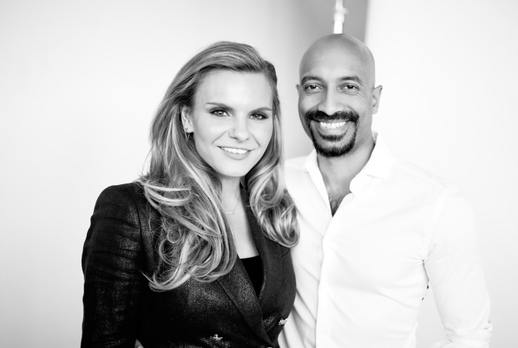

# Clearbanc Case Study

## Clearbanc Origin & Company Overview

 

Clearbanc is a modern non-dillutive capital as a service (CaaS) firm. The FinTech comapny was founded in 2015 and is headquartered in Toronto, Canada.

**President & Co-founder**: Michele Romanow (left) 
**CEO & Co-founder**: Andrew D’Souza (right)

Additional **key members** include; 
* VP of finance & co-founder: Ivan Gritsiniak
* VP of Business operations & co-founder: Charlie Feng
* VP of product & co-founder: Tanay Delima

### How did the idea for the company (or project) come about?

*“By founders for founders”* - both Romanow and D’Souza are considered serial entrepreneurs with admirable experience and success in the digital industry. Experiencing both sides of the entrepreneurial field, Clearbanc partners recognized a serious flaw in the current funding systems available to emerging businesses and startups. Founders are passionate about their ideas and should not have to offer a portion of their business to private equity investors to fulfill their business objectives. The market had a desperate need for a modern funding structure (que Clearbanc). Inspired by their own experiences, Clearbanc devised a solution; an equity-free investor model.

### How is the company funded? How much funding have they received?

Backed by outstanding reputation and experience, Clearbanc founders' alternative to the venture capitalist idea continues to attract growing attention from investors. The most recent equity report released in 2019 indicates Clearbanc has had two funding periods raising a total of $300 million CAD. From the public records Clearbanc provides, over 80 per cent ($250 million CAD) of acquired equity is provided by the company’s limited partners. The raised capital is allocated as a series three fund to assist Clearbanc’s ecommerce partners develop their business efforts successfully. The remaining portion of total funding Clearbanc received was at the end of 2018, allocating $50 million CAD as a series B funding source from high stake investors such as; Highland Capital, iNovia, and Emergence Capital. 
